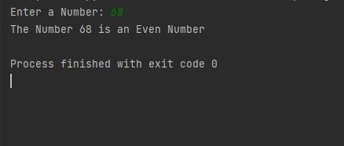
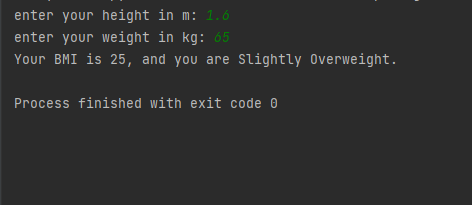
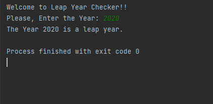
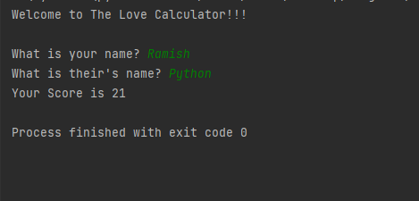
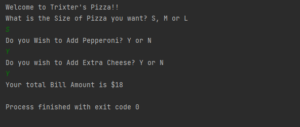
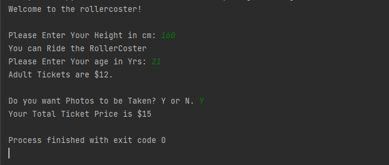
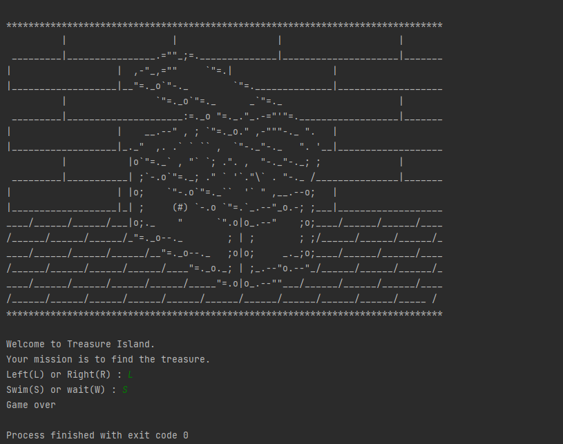

# Usage of Conditional Statements

## In this project there are 7 Programs.

### 1. Odd Even:- This program checks if the number entered by the user is Odd or Even.

### 2. BMI Calculator:- This program Calculates the BMI and Prints out your body type according to the Health Norms.

### 3. Leap Year:- This program Checks if the Year entered is a Leap year or not.

### 4. Love Calculator:- This Program Calculates the love❤️ between two entities.

### 5. Pizza Order:- This program Asks user for the Size, Toppings etc of Pizza🍕 from the user and prints out the price of 🍕.

### 6. Roller Coaster🎢:- This Program Asks for Height, Age, if you need photo or not? and prints out the Ticket price you should pay.

### 7. Treasure Island:- This Program Asks for the directions, and at the end it tells if you got the treasure or Game Over!

## What I Learned in this project.
1. Conditional Statements (If, Else, Elif)
2. String Methods (count(), lower())
3. round() function.
4. Type Casting.
5. String Comparison.
6. Doc Strings (""""Something, Something....""")

